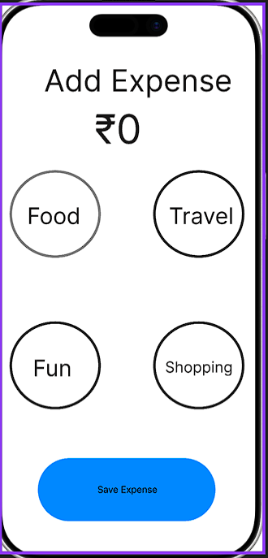
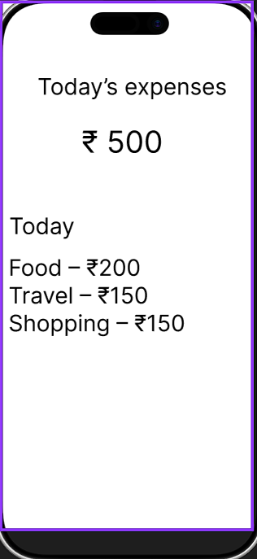

# Expense Tracker UX

## Overview
This project focuses on designing a minimal expense tracking interface that allows users to log expenses quickly and efficiently.

## Problem
Many expense tracking apps are complex and time-consuming, which discourages regular use.

## Solution
A simplified UI that:
- Reduces steps to add an expense
- Uses quick category selection
- Provides a clear daily summary

## Screens

### Add Expense Screen

### Daily Summary Screen

## Tools Used
- Figma

## Key UX Focus
- Simplicity
- Speed
- Reduced cognitive load
